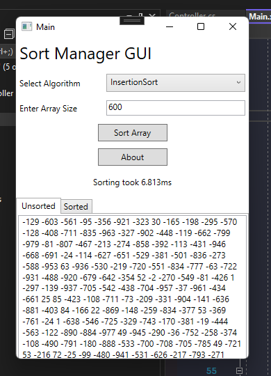
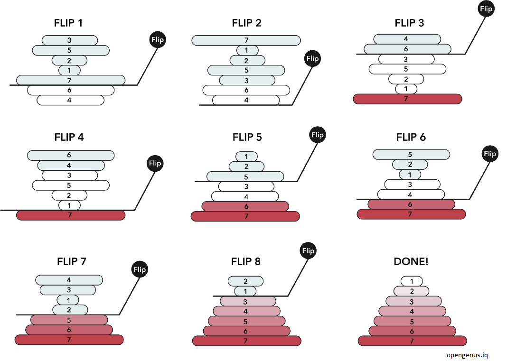

# **Sort Manager Project**
 
 
 
 _Participants:_
 - Sergiusz (Scrum Master)
 - Tudor
 - Nathan
 - Lewis
 - Connor
 - Adam M

 [Trello Link](https://trello.com/invite/b/0PNFBurf/dc6ebc7bef4887c6d2ffc521b98e20f7/sprint-1)

 # **Sort Manager Project Description**

 This collaborative GitHub project contains an application in which takes a users input for a random array, sorts the given array depending on what sorting algorithm the user picks (via the command line) and then ouputs the time taken to sort the array, the sorted or (potentially) unsorted array and the algorithm that was used to sort the given array.

 # **How the program will work:**
 
 ## **Console View:**
 The user will be presented with a console menu consisting of all the sorting algorithms avaliable to them numbered. The user will then select a sorting algorithm by inputting a number and press enter to confirm.
 
 
 The user will then be asked in input an array size to be sorted by the algorithm. 
 

 The Console will then display the unsorted array and the sorted array, alongside the time it took to sort the array given the sorting algorithm. The user can do another sorting algorithm by pressing any key after the array has been sorted. If the user would like to leave the program then at the main slection menu the user can type enter. Finally, the program will close with a thank you message for using our application.

 

 ## **GUI View:**
 The user will select the algorithm that they would like to sort their array by from a drop down list provided. Following from this, the user will then enter an integer array size into the input box below. Then, the user will be given a sort button in which they click and the code behind the GUI will create , sort and return the sorted and unsorted arrays back to the GUI within the sorted and unsorted tabs. Finally, the user can exit the GUI by pressing the x button at the top right of the GUI.
 
 

 # **Key features implemented:**
 
 The main architectual pattern we used was Model View Controller (MVC). In which we have a seperate IO(View) from the Controller and Model and the Factory method pattern to generate the requested Model classes.

 Within our program there is implmentation of all four pillars of Object Oriented Programming (OOP) whilst upholding Test Driven Development (TDD). These consist of:

 1. Abstraction
 2. Encapsulation
 3. Inheritance
 4. Polymorphism
   
 ### **Graphical User Interface:**
 The user interface will consist of a simple functional GUI. In which, the user will select the algorithm that they would like to sort their array by from a drop down list provided. Following from this, the user will then enter an integer array size into the input box below. Then, the user will be given a sort button in which they click and the code behind the GUI will create , sort and return the array back to the GUI. The speed of the sort is displayed to the user (in ms) in the same GUI menu with the Unsorted array displayed in a tab below with another tab next to it called Sorted in which shows the sorted array. Finally, the user can exit the GUI by pressing the x button at the top right of the GUI.

 Below is an image of the simple wireframe of how our GUI would be expected to look like and what the current GUI interface looks like to the user when the program is executed:

 

 

 ### **Stopwatch:**  
 Stopwatch was implemented in order to time how fast the user selected sorting algorithm would take to sort the users array.

 Below is an image of the Profiler class in which handles the timing of the sorting algorithms using the Stopwatch constructor:

 

 ### **Sorting Algorithms:**

 ### **Bubble Sort:**
 Bubble Sort is a simple sorting algorithm that iteratively swaps around values in an array so that the opposite numbers are in the ascending order. Our program- when the user selects the Bubble Sort algorithm- will examine each pair in the array, iterating for the amount of pairs in the array. The sorted array is then returned to the Controller.

 Below is an image of how the Bubble Sort algorithm works:

 
 
 [Image from ProductPlan](https://www.google.com/imgres?imgurl=https%3A%2F%2Fwww.productplan.com%2Fuploads%2Fbubble-sort-1024x683-2.png&imgrefurl=https%3A%2F%2Fwww.productplan.com%2Fglossary%2Fbubble-sort%2F&tbnid=XCt96s7yTuSg1M&vet=12ahUKEwi-3Kbf9M36AhURWxoKHYeoCaMQMygBegUIARDnAQ..i&docid=mviKTR0SNkg67M&w=1024&h=683&q=bubble%20sort&ved=2ahUKEwi-3Kbf9M36AhURWxoKHYeoCaMQMygBegUIARDnAQ)
 
 ### **Merge Sort:**
 Merge Sort is a recursive divide & conquer sorting algorithm that calls upon itself when sorting the array. This is done by splitting the given array into left and right sub arrays. The arrays are recursively split until each array has one value. Each value is then compared with each other before being re-combined.

 Below is an image of how the Merge Sort algorithm works:

 
 
 [Image from GeeksforGeeks](https://www.geeksforgeeks.org/merge-sort/)

 ### **Net Sort:**

 Partition Size | Sorting Method | Time Complexity (Worst Case)
 --- | --- | ---
 <= 16 | Insertion Sort | O (n^2)
  Greater Than 2log(n) | Heap Sort | O (nlog(n))
 < 16 && > 2log(n) | Quick Sort | O (nlog(n))

 ### **Selection Sort:**
 Selection sort is an in-place comparison algorithm. The algorithm divides the input list into two parts:
 1. A sorted sublist of items
 2. A sublist of the remaining unsorted items that occupy the rest of the list
 
 the algorithm finds the smallest element in the unsorted sublist  and swaps it for the leftmost unsorted element and moving he sublist boundaries one element to the right.

 Below is a gif of how the Selection Sort algorithm works:

 

  Red is the current minimun. Yellow is sorted and Blue is the current item.

 [Gif from Wikipedia](https://en.wikipedia.org/wiki/Selection_sort)
 
 ### **Insertion Sort:**
 Insertion sort is a simple sorting algorithm that builds the final sorted array (or list) one item at a time. It is much less efficient on large lists than more advanced algorithms such as quicksort, heapsort, or merge sort.  It does so by comparing values  in turn, starting the the second value. If this value is greater than the value to the left of it, no changes are made. Otherwise this value is repeatedly moved left until it meets a value that is less than it. The sort process then starts again with the next value.

 Below is an image of how the Merge Sort algorithm works:

 
 
 [Image from GeeksforGeeks](https://www.geeksforgeeks.org/insertion-sort/)

 ### **Heap Sort:**
 Heap sort works by visualizing the elements of the array as a special kind of complete binary tree called a heap.The heapsort algorithm involves preparing the list by first turning it into a max heap. The algorithm then repeatedly swaps the first value of the list with the last value, decreasing the range of values considered in the heap operation by one, and sifting the new first value into its position in the heap.
 
 Below is an image of how the Heap Sort algorithm works:
 
 

 [Image from Alphacodingskills](https://www.alphacodingskills.com/php/pages/php-program-for-heap-sort.php)
 
 ### **Pancake Sort:**
 The pancake sort works by taking an array and "flipping" it upside down like a stack of pancakes. In order for elements to be placed in the right positions, the "pancake stack" needs to be flipped once so it's bottom side up, and once more. Unlike a traditional sorting algorithm, which attempts to sort with the fewest comparisons possible, the goal is to sort the sequence in as few reversals as possible. The idea is to do something similar to Selection Sort. We one by one place maximum element at the end and reduce the size of current array by one.

 Below is an image of how the Pancake Sort algorithm works:
 
 
 [Iameg from Opengenus](https://iq.opengenus.org/pancake-sort/)
 
 # Some Challenges faced:
 
 The project as a whole went very smoothly as everyone followed Agile Principles.

 1. Creating effective and simple user stories
 2. Assigning roles to each team memeber
 3. Git Version control

 # Features we hope to implement in the future: 

 - Other sorting algorithms

