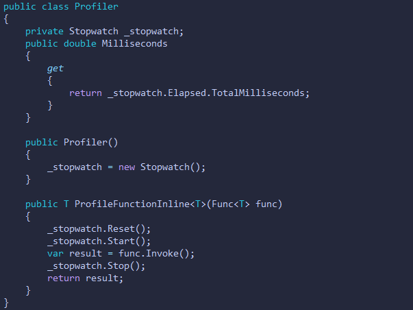

# **Sort Manager Project**

 _Participants:_
 - Sergiusz (Scrum Master)
 - Tudor
 - Nathan
 - Lewis
 - Connor
 - Adam M

 [Trello Link](https://trello.com/invite/b/0PNFBurf/dc6ebc7bef4887c6d2ffc521b98e20f7/sprint-1)

 # **Sort Manager Project Description**

 This collaborative GitHub project contains an application in which takes a users input for a random array, sorts the given array depending on what sorting algorithm the user picks (via the command line) and then ouputs the time taken to sort the array, the sorted or (potentially) unsorted array and the algorithm that was used to sort the given array.

 # **Key features implemented:**
 
 The main architectual pattern we used was Model View Controller (MVC). In which we have a seperate IO(View) from the Controller and Model and the Factory method pattern to generate the requested Model classes.

 Within our program there is implmentation of all four pillars of Object Oriented Programming (OOP). These consist of:

 1. Abstraction
 2. Encapsulation
 3. Inheritance
 4. Polymorphism
   
 ### **User Interface:**

 (INSERT IMAGE HERE)

 ### **Stopwatch:**  

 

 ### **Sorting Algorithms:**

 ### **Bubble Sort:**
 Bubble Sort is a simple sorting algorithm that iteratively swaps around values in an array so that the opposite numbers are in the ascending order. Our program- when the user selects the Bubble Sort algorithm- will examine each pair in the array, iterating for the amount of pairs in the array. The sorted array is then returned to the Controller.

 Below is an image of how the Bubble Sort algorithm works:

 
 
 [Image from ProductPlan](https://www.google.com/imgres?imgurl=https%3A%2F%2Fwww.productplan.com%2Fuploads%2Fbubble-sort-1024x683-2.png&imgrefurl=https%3A%2F%2Fwww.productplan.com%2Fglossary%2Fbubble-sort%2F&tbnid=XCt96s7yTuSg1M&vet=12ahUKEwi-3Kbf9M36AhURWxoKHYeoCaMQMygBegUIARDnAQ..i&docid=mviKTR0SNkg67M&w=1024&h=683&q=bubble%20sort&ved=2ahUKEwi-3Kbf9M36AhURWxoKHYeoCaMQMygBegUIARDnAQ)
 
 ### **Merge Sort:**
 Merge Sort is a recursive divide & conquer sorting algorithm that calls upon itself when sorting the array. This is done by splitting the given array into left and right sub arrays. The arrays are recursively split until each array has one value. Each value is then compared with each other before being re-combined.

 Below is an image of how the Merge Sort algorithm works:

 
 
 [Image from GeeksforGeeks](https://www.geeksforgeeks.org/merge-sort/)

 ### **Net Sort:**

 Partition Size | Sorting Method | Time Complexity (Worst Case)
 --- | --- | ---
 <= 16 | Insertion Sort | O (n^2)
  Greater Than 2log(n) | Heap Sort | O (nlog(n))
 < 16 && > 2log(n) | Quick Sort | O (nlog(n))

 ### **Selection Sort:**
 Selection sort is an in-place comparison algorithm. The algorithm divides the input list into two parts:
 1. A sorted sublist of items
 2. A sublist of the remaining unsorted items that occupy the rest of the list
 
 the algorithm finds the smallest element in the unsorted sublist  and swaps it for the leftmost unsorted element and moving he sublist boundaries one element to the right.

 Below is a gif of how the Selection Sort algorithm works:

 

  Red is the current minimun. Yellow is sorted and Blue is the current item.

 [Gif from Wikipedia](https://en.wikipedia.org/wiki/Selection_sort)
 
 ### **Insertion Sort:**
 Insertion sort is a simple sorting algorithm that builds the final sorted array (or list) one item at a time. It is much less efficient on large lists than more advanced algorithms such as quicksort, heapsort, or merge sort.  It does so by comparing values  in turn, starting the the second value. If this value is greater than the value to the left of it, no changes are made. Otherwise this value is repeatedly moved left until it meets a value that is less than it. The sort process then starts again with the next value.

 Below is an image of how the Merge Sort algorithm works:

 
 
 [Image from GeeksforGeeks](https://www.geeksforgeeks.org/insertion-sort/)

 ### **Heap Sort:**
 Heap sort works by visualizing the elements of the array as a special kind of complete binary tree called a heap.
 
 ### **Test Driven Development:**

 # Some Challenges faced:
 
 The project as a whole went very smoothly as everyone followed Agile Principles.

 1. Creating effective and simple user stories
 2. Assigning roles to each team memeber
 3. Git Version control

 # Features we hope to implement in the future: 

 - Other sorting algorithms
